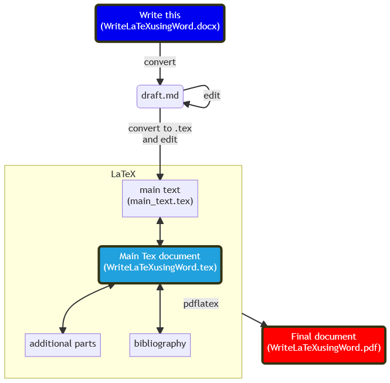

This is short document how to write LaTeX documents using Word. Working principle is to write Word-document with some LaTeX-command that are used to include citations and references, figures, tables, and equations using LaTeX. Figure below illustrates the working principle. For more detailed information, see Word-document or converted pdf-file.

