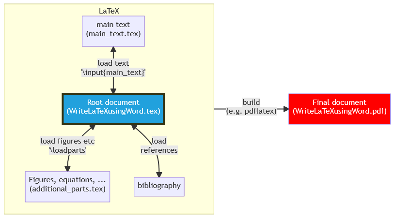

This is short example how to write LaTeX documents using Word. 

Even though you know LaTeX (or you are willing to learn it), this repo can be useful when
- your supervisor(s) and/or co-authors are not familiar with LaTeX, in other words you can not share LaTeX document with them
- you do not want to manually move their comments, edits, and texts to your LaTeX-document
  
Working principle is to write Word-document with some LaTeX-command. Firstly, write you document in Word with LaTeX-commands that are used to include citations and references, symbols, figures, tables, and equations using LaTeX. Then, convert the Word-document to .tex using the Powershell script (_worddoc_to_tex.ps1_). If needed, upload (e.g. if using Overleaf) the converted .tex file so that your main/root LaTeX document (_WriteLaTeXusingWord.tex_ in this example) can find it. Then, you can build the final document e.g. using pdflatex. Flowcharts below illustrates the working principle. For more detailed information, see Word-document or converted pdf-file.




## Additional support: level up section heading level 
Current version will create `\section` headings in converted .tex file for those lines that are written as Heading 1 level on your Word-document, `\subsection` for Heading 2, etc. 
However, if your LaTeX-document class is for example book, you should probably increase each section level, so that each `\section` would be `\chapter`, each `\subsection` would be `\section`, and so on. 
In this case, additional script `increase_section_level.ps1` can be used to make this conversion automatically:
```powershell
$modified_file_name = 'main_text.tex' # give file name to be edited
(gc $modified_file_name) | % {$_ -replace "\\section{", "\chapter{"} | sc $modified_file_name
(gc $modified_file_name) | % {$_ -replace "\\section*{", "\chapter*{"} | sc $modified_file_name # abstract etc non-numbered chapters
(gc $modified_file_name) | % {$_ -replace "\\subsection{", "\section{"} | sc $modified_file_name 
(gc $modified_file_name) | % {$_ -replace "\\subsubsection{", "\subsection{"} | sc $modified_file_name  
# optional: convert \paragraph to \subsubsection and \subparagraph to \paragraph, uncomment if needed
# (gc $modified_file_name) | % {$_ -replace "\\paragraph{", "\subsubsection{"} | sc $modified_file_name  # typically not used
# (gc $modified_file_name) | % {$_ -replace "\\subparagraph{", "\paragraph{"} | sc $modified_file_name  # typically not used
```


# Acknowledgment
I warmly thank Juhana Ketola for his pro bono help related to PowerShell. Thanks to my current and former colleagues, Sampo Tuukkanen, Mikko Peltokangas and Ville Rantanen helping with LaTeX, especially introducing _catchfilebetweentags_ package, developed by Florent Chervet. Special thanks for Florent, your work saved me a lot of time! Furthermore, “tom’s” (sorry, couldn’t find author information, please share!) great [blog post in texblog](https://texblog.org/2012/12/04/keeping-things-organized-in-large-documents/) helped to implement _catchfilebetweentags_ package.
