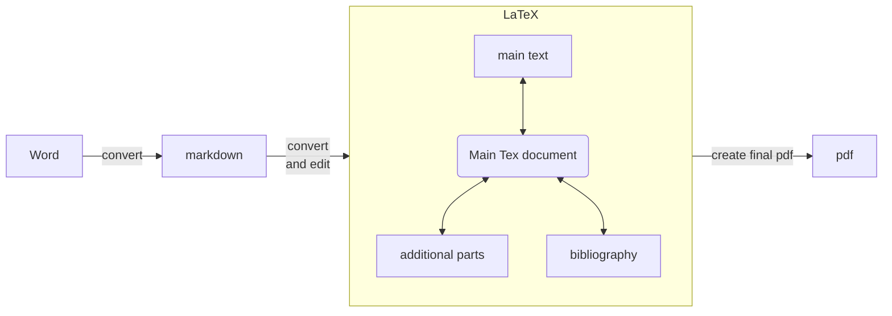

This is short document how to write LaTeX documents using Word. Working principle is to write Word-document with some LaTeX-command that are used to include citations and references, figures, tables, and equations using LaTeX. 

For more detailed information, see Word-document or converted pdf-file.

- [kuva](doc_pics/2021-12-22-13-39-47.png)

- päiväkirjadokkarissa hyvin input parametrit .ps1 tiedostolle: `G:\My Drive\Docs\Lapset_ja_koti\Paivakirja\Lapsilleni_Markdown\mdtotex.ps1`



```mermaid
flowchart LR
    idc1("Convert <br> Word") 
    idc1 --> |run <br> Worddoc_to_tex.ps1| idw %%|load| idw

    idctexdraft["main text <br> (main_text.tex)"]
    subgraph s1[Convert Word to tex]
        idw["Main text <br> (WriteLaTeXusingWord.docx)"]
        idw --> |"convert <br> (pandoc)"| idcmd %% idw --> |pandoc <br> conversion| idcmd
        idcmd["draft text<br> (draft.md)"] --> |"modify text <br> and convert (pandoc)"| idctexdraft
        idctexdraft -.-> |delete draft.md <br> after .tex conversion ready| idcmd
    end

    %% TOINEN ALLA %%%%%%%%%%%%%%%%%%%%%%%%%%%%%%%%%
    idc2("Build document")
    idc2 --> main_tex
    main_tex --> |"build pdf"| idc3["final pdf <br> (WriteLaTeXusingWord.pdf)"]
    
    idtex["Main tex document<br> (WriteLaTeXusingWord.tex)"]
    idctexdraft2["main text <br> (main_text.tex)"]
    idparts["Figures, equations, ...<br> (additional_parts.tex)"]
    subgraph main_tex[load document]
        direction TB
        idctexdraft2 <--> |"load main text <br> '\inputfile'"| idtex
        idtex <--> |"load figures etc <br> '\loadparts'"| idparts
    end
    %% Set the classes. Sub=includes subfunctions, 
    classDef aloitus fill:#0000f0,color:#ffffff,stroke:#331,stroke-width:4px
    classDef lopetus fill:#ff0000,color:#ffffff 
    classDef word fill:#21dd9b,color:#ffffff,stroke:#331,stroke-width:4px
    classDef tex fill:#21a1dd,color:#ffffff 
   
    %% Assign the classes.   
    class idc1,idc2, aloitus;
    class idc3, lopetus;
    class idw, word;
    class idtex, tex;
    
```

## erillään
```mermaid
flowchart LR
    idc2("Build document") %%("Build pdf") 
    idc2 --> main_tex
    main_tex --> |"build pdf"| idc3["final pdf <br> (WriteLaTeXusingWord.pdf"]
    subgraph main_tex[load document]
        direction TB
        idtex["Main tex document<br> (WriteLaTeXusingWord.tex)"]
        idctexdraft2["draft text <br> (textfile.tex)"]
        idparts["Figures, equations, ...<br> (additional_parts.tex)"]
        idctexdraft2 <--> |"load main text <br> '\inputfile'"| idtex
        idtex <--> |"load figures etc <br> '\loadparts'"| idparts
    end
    %% Set the classes. Sub=includes subfunctions, 
    classDef aloitus fill:#0000f0,color:#ffffff %%,stroke:#331,stroke-width:4px
    classDef lopetus fill:#ff0000,color:#ffffff 
    classDef word fill:#21dd9b,color:#ffffff %%,stroke:#331,stroke-width:4px
    classDef tex fill:#21a1dd,color:#ffffff 
    
    %% Assign the classes.
    %% class idtex, word;
    class idtex, tex;
    class idc2, aloitus;
    class idc3, lopetus;
```


